# CS110 Project Proposal
# Space(bar) Shooter
## CS 110 Final Project
### Fall Semester, 2021
### [Assignment Description](https://docs.google.com/document/d/1H4R6yLL7som1lglyXWZ04RvTp_RvRFCCBn6sqv-82ps/edit#)

https://github.com/bucs110a0fall21/final-project-dads-who-code

https://docs.google.com/presentation/d/1Hrg1JD_5lIif12mqWpreXv9HraxGVm0e-0BmkCVTPAg/edit#slide=id.gca4537879_0_15

### Team: Dads Who Code
#### Nolan Smithers (Software Lead), Alicia Unterreiner (Backend Specialist), Shreya Shetty (Front End Specialist)

***

## Project Description *(Software Lead)*
Our project is a galaga/space defenders like arcane shooter, where the user defends against space aliens. The enemies move down the screen and fire at the player, causing a game over scenario if they either shoot the player, reach the bottom of the screen or collide with the player. The user can move across the screen and fire at the aliens to destroy them. If they succeed in clearing the enemies from the screen, the level increases, more enemies are spawned and they fire with higher shot frequency. This continues until one of the previously mentioned game over conditions is met.

***    

## User Interface Design *(Front End Specialist)*
* 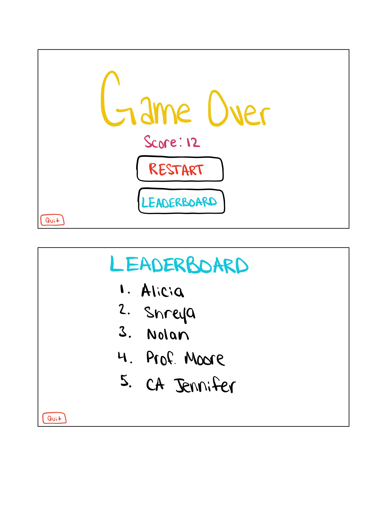
Once the player inputs their name the game will switch to the game over screen. If the player's score was within the top 10 scores then it will be added to the leaderboard. The player then has the option to play again by clicking the restart button.
* 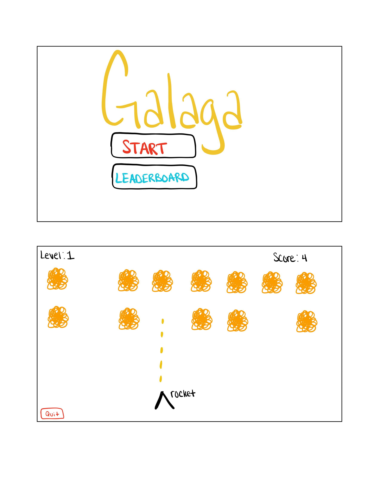
The start screen for our game. The start button shown underneath the title will bring you to the game animation once clicked.
Mid game screenshot. The enemies are animated and shoot at the player. The player can move left to right and shoot bullets at the enemies. The score increases as they destroy enemies and once all of the enemies have been destroyed, a new level starts.
    * For example, if your program has a start screen, game screen, and game over screen, you should include a wireframe / screenshot / drawing of each one and a short description of the components
* 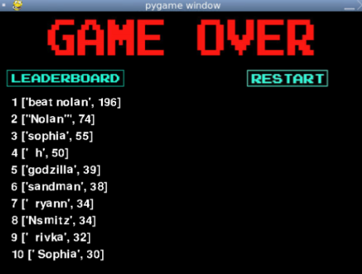
* 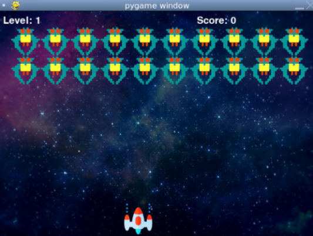
* 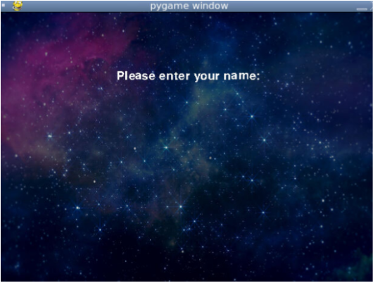
* 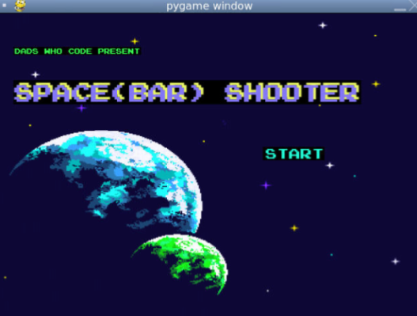

***        

## Program Design *(Backend Specialist)*
* Non-Standard libraries
    * N/A
    * For each additional module you should include
        * url for the module documentation
        * a short description of the module
* Class Interface Design
    * 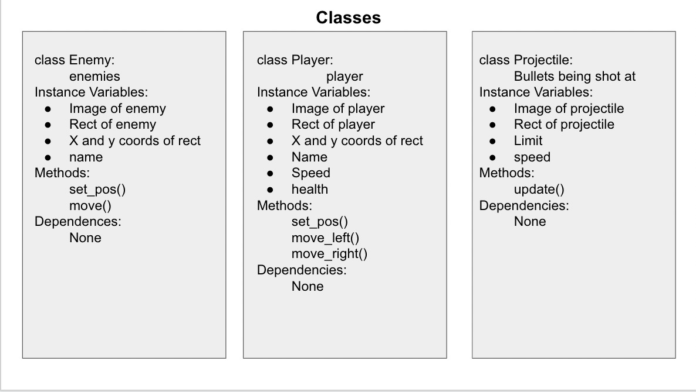
        * 
    * This does not need to be overly detailed, but should show how your code fits into the Model/View/Controller paradigm.
* Classes
    * class Controller: controls all interactions between classes
    * class Enemy: enemy that moves in one direction
    * class Player: user controlled class that moves left and right
    * class Projectile: the projectile class that the player fires
    * class HostileProjectile: the projectile class that the enemies fire

## Project Structure *(Software Lead)*

The Project is broken down into the following file structure:
* main.py
* bin
    * Controller.py
    * Enemy.py
    * HostileProjectile.py
    * Player.py
    * Projectile.py
* assets
    * 
    * 
    * 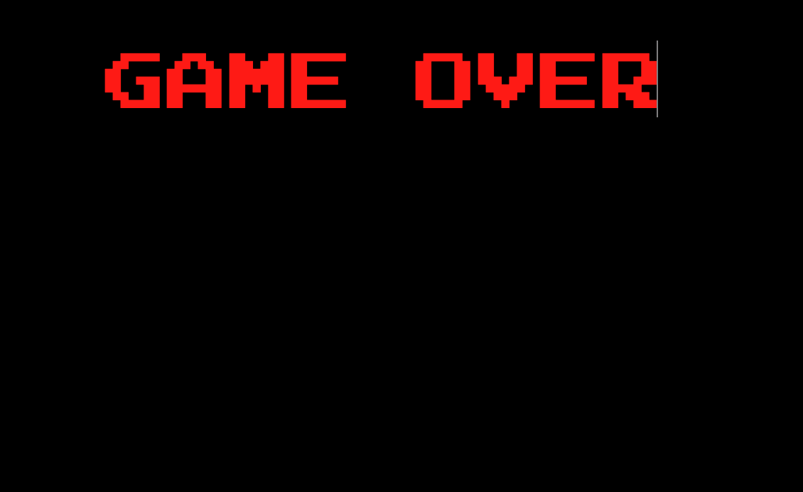
    * 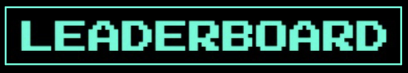
    * 
    * 
    * 
    * 
    * 
    * 
    * 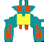
    * 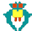
    * 
    * 
    * 
    * 
    * 
    * 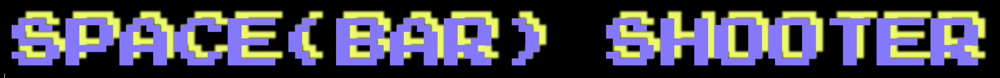
    * 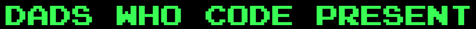
    * 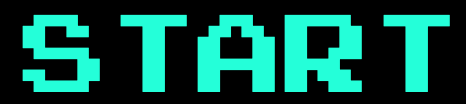
    * 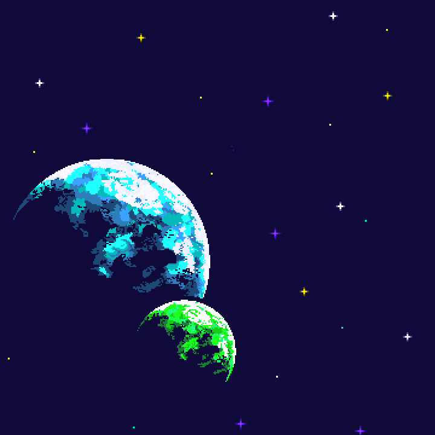
    * 

***

## Tasks and Responsibilities *(Software Lead)*

### Software Lead - Nolan Smithers

Worked as an integration specialist by combining the front and backend code into a working program. Developed ideas to streamline efficiency and coordinated workloads and work schedules.

### Front End Specialist - Shreya Shetty

Created the background images for the project and implemented the images into the project.

### Back End Specialist - Alicia Unterreiner

Constructed the methods and logic used throughout the program.

## Testing *(Software Lead)*
* We tested our project weekly during project development meetings and occasionally on our own time. Our testing emphasized attempting to break our code to ensure that the user could not.
    * We attempted to break our code by moving the player class off of the screen and realized that we had set the user boundaries too far and we were able to fix it.

* Your ATP

| Step                  | Procedure     | Expected Results  | Actual Results |
| ----------------------|:-------------:| -----------------:| -------------- |
|  1  | Open the terminal, move to folder, type "python3 main.py" | The program starts and displays the start screen|          |
|  2  | Click the "Start" button | The game initializes properly |                 |
|  3  | Click SPACE BAR | The user ship fires a "projectile" | |
|  4  | Click LEFT ARROW, hold LEFT ARROW | 1) The ship moves to the left, 2) Continues to move left while held down | |
|  5  | Click RIGHT ARROW, hold LEFT ARROW | 1) The ship moves to the right, 2) Continues to move right while held down | |
|  6  | Attempt to move ship off-screen | The ship stays on screen | |
|  7  | General playtesting | 1) The projectiles destory the enemies, 2) Enemies fire projectiles that destroy the player, 3) The enemies move down the screen, 4) Score is displayed on screen and increases when player destorys an enemy | |
|  8  | Attempt to destroy all enemies | 1) Level is increased and enemies are replaced, 2) The score is not reset and accumulates | |
|  9  | Force "Game Over" Screen | 1) Reach "Game Over" by allowing player to be hit by a projectile and by allowing enemy to reach bottom, 2) Allows player to enter a highscore name if applicable | |
|  10  | Test buttons on "Game Over" | 1) "Play" restarts the game, 2) "High Score" button shows the high score (Phase 2) | |
|  11  | Click "Quit" button in corner | Game closes properly | |
